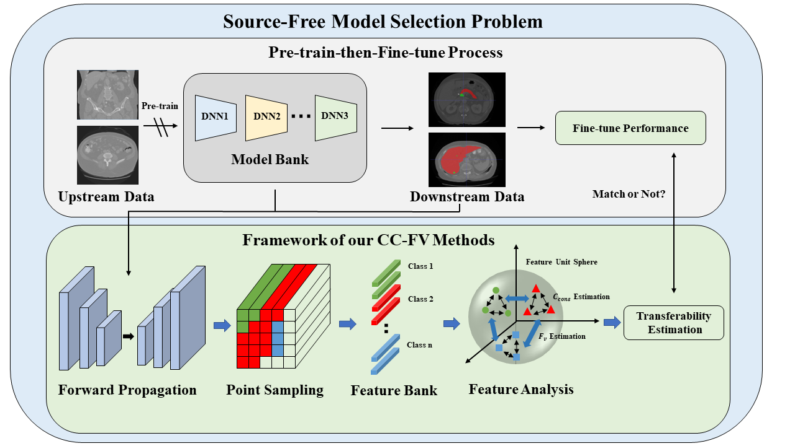

# MICCAI2023_CCFV

# Introduction

Official implementation of MICCAI 2023 paper "Pick The Best Pre-trained Model: Towards Transferability Estimation For Medical Image Segmentation"(**early accepted, 14%**)

# Preparation
## Environment Setup
    python=3.7
    scipy=1.7.3
    numpy=1.21.6
    monai=1.0.1
    torch=1.13.0

## Dataset Preparation
1. Download the MSD Dataset from [here](http://medicaldecathlon.com/)
2. Preprocess the data using [nnUNet](https://github.com/MIC-DKFZ/nnUNet)

## Checkpoint Download
You can download our pretrained checkpoing of unet
and unetr at [here](https://www.aliyundrive.com/s/DzqA2aZzsLa)

Code:n17v

## Example
    bash run.sh

